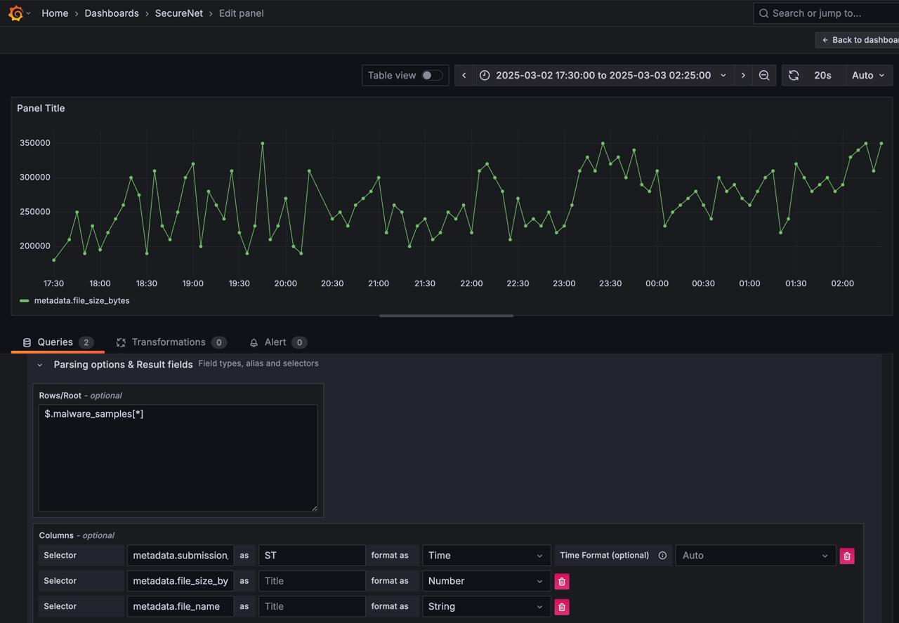
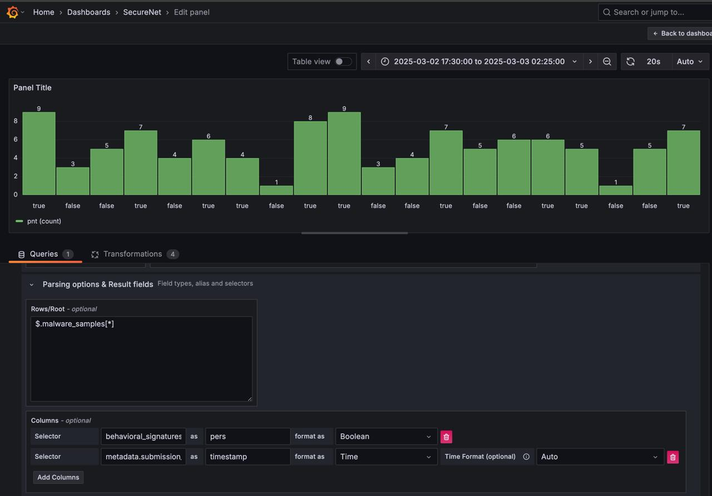
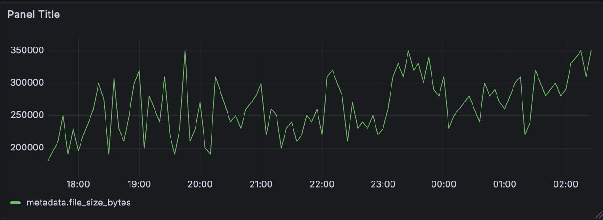
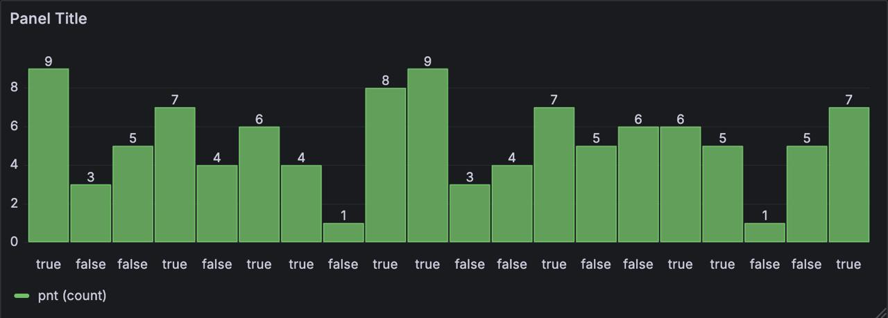

# SecureNet - Analysis

## Overview
This project establishes a comprehensive malware detection and analysis pipeline integrating YARA, Snort, machine learning-based classification, CAPEv2 sandboxing, and a Grafana-based visualization dashboard. The workflow ensures efficient detection, classification, and in-depth analysis of potential malware threats.

## Workflow
1. **Initial Detection (YARA and Snort)**
   - Suspicious files are first scanned using YARA for known malware signatures.
   - Snort is used to detect potential network intrusions and malicious IP traffic.
   
2. **Machine Learning-Based Classification**
   - Files that pass through YARA and Snort undergo feature extraction and classification using a machine learning model.
   - If classified as malware or suspicious, the files are forwarded to CAPEv2 for further analysis.
   - If a file is classified as benign, it is discarded.
   
3. **Sandbox Analysis with CAPEv2**
   - CAPEv2 provides in-depth behavioral analysis of detected malware.
   - If a file does not exhibit malicious behavior in CAPEv2, it is marked as a false positive.
   
4. **Data Conversion and Visualization**
   - CAPEv2 output is converted to JSON format.
   - The JSON data is pushed to GitHub.
   - Grafana visualizes the analysis results, providing insights into detected threats, timestamps, file sizes, attacking IP addresses, and other relevant metadata.

---

## Installation Guide

### Step 1: Setting Up the Environment
#### System Requirements
- Ubuntu 22.04.5 LTS
- Nested Virtualization Enabled
- Minimum 8 GB RAM and 4 CPU cores
- Sufficient disk space for malware analysis

#### Installing Required Dependencies
```bash
sudo apt update && sudo apt upgrade -y
sudo apt install git python3 python3-pip -y
```

### Step 2: Installing CAPEv2
1. **Clone the CAPEv2 Repository**
   ```bash
   sudo apt-get install git -y
   git clone https://github.com/kevoreilly/CAPEv2.git
   ```

2. **Modify the KVM Installer**
   ```bash
   cd CAPEv2/installer
   ls -lh
   ```
   - Obtain the DSDT code string by using one of the following methods:
     ```bash
     sudo apt install acpica-tools -y
     sudo acpidump > acpidump.out
     sudo acpixtract -a acpidump.out
     sudo iasl -d dsdt.dat
     ```
   - Replace the `<WOOT>` string in `kvm-qemu.sh` with the correct DSDT code.

3. **Execute the KVM Installer**
   ```bash
   sudo chmod a+x kvm-qemu.sh
   sudo ./kvm-qemu.sh all cape 2>&1 | tee kvm-qemu.log
   sudo ./kvm-qemu.sh virtmanager cape 2>&1 | tee kvm-qemu-virtmanager.log
   ```
   - Reboot the system after installation.

4. **Install CAPEv2 (Sandbox System)**
   ```bash
   cd /opt/CAPEv2/installer
   sudo chmod a+x cape2.sh
   sudo ./cape2.sh base 2>&1 | tee cape2-base.log
   ```
   - Reboot the system after installation.

5. **Ensure PostgreSQL Database Configuration**
   ```bash
   sudo -u postgres psql
   \list
   ALTER DATABASE cape OWNER TO cape;
   \q
   ```

### Step 3: Setting Up Windows 10 as a Victim Machine
1. Download a Windows 10 ISO and create a VM in CAPEv2.
2. Configure the VM for malware execution:
   - Disable Windows Defender.
   - Enable guest-to-host networking.
   - Ensure the VM is configured to interact with CAPEv2.
3. Take a snapshot of the VM for repeated malware analysis.

### Step 4: Integrating YARA and Snort
1. **Install YARA**
   ```bash
   sudo apt install yara -y
   ```
   - Add custom YARA rules for malware detection.

2. **Install and Configure Snort**
   ```bash
   sudo apt install snort -y
   ```
   - Update Snort rules to detect suspicious network traffic.

### Step 5: Running the Machine Learning Model
- Extract features from files that pass YARA and Snort.
- Classify them using the trained ML model.
- If malware is detected, forward it to CAPEv2.

### Step 6: Converting CAPEv2 Output to JSON
1. Extract CAPEv2 reports:
   ```bash
   cd /opt/CAPEv2/storage/analyses/
   find . -name "report.json" -exec cp {} /path/to/output/ \;
   ```
2. Push JSON data to GitHub repository:
   ```bash
   cd /path/to/output/
   git add .
   git commit -m "Updated CAPEv2 analysis reports"
   git push origin main
   ```

### Step 7: Visualizing Data with Grafana
1. Install Grafana and configure Infinity Plugin:
   ```bash
   sudo apt install -y grafana
   sudo systemctl enable --now grafana-server
   ```
2. Use the Infinity Plugin to fetch JSON data from GitHub and visualize analysis results.
3. The sample output of Grafana is uploaded as a set of images.





### Step 8: Prevention Strategies
#### Blocking Malicious IPs with Snort
1. Open the Snort configuration file:
```bash
sudo nano /etc/snort/snort.conf
```
2. Add a rule to drop packets from identified malicious IPs:
```bash
drop ip [MALICIOUS_IP] any -> any any (msg:"Blocked Malicious IP"; sid:1000001;)
```
3. Restart Snort to apply changes:
```bash
sudo systemctl restart snort
```

#### Additional Prevention Measures
- **Firewall Rules:** Use `iptables` or `ufw` to block identified malicious IPs.
  ```bash
  sudo ufw deny from [MALICIOUS_IP]
  ```
- **Regular YARA Rule Updates:** Keep YARA rules updated with the latest threat intelligence feeds.
- **Email Alerts:** Configure alerts for detected threats using `fail2ban` or `Snort`.
- **Automatic Log Analysis:** Set up a cron job to periodically analyze logs and update Snort rules.

1. The IP adress
## Conclusion
This pipeline provides a structured approach to malware detection, classification, and analysis using multiple tools, ensuring comprehensive threat intelligence. The integration of CAPEv2 and Grafana enhances the ability to monitor and understand malware behavior effectively.


